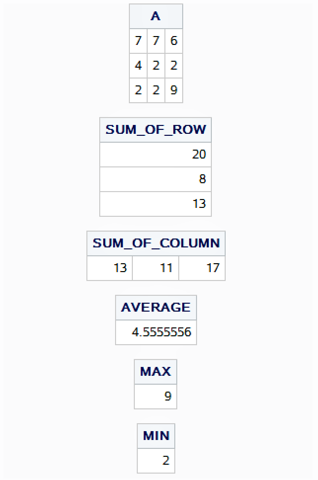
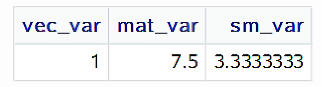
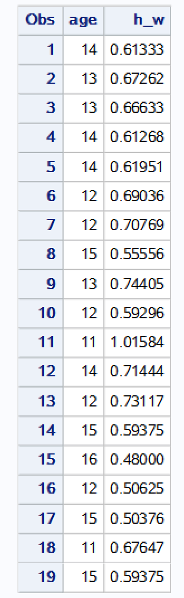
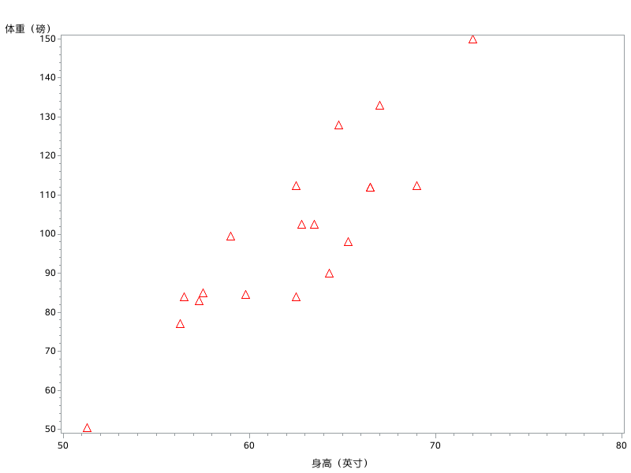
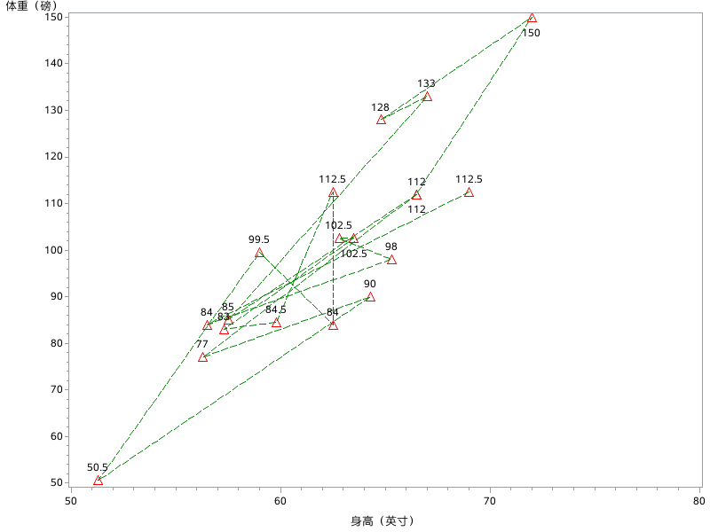
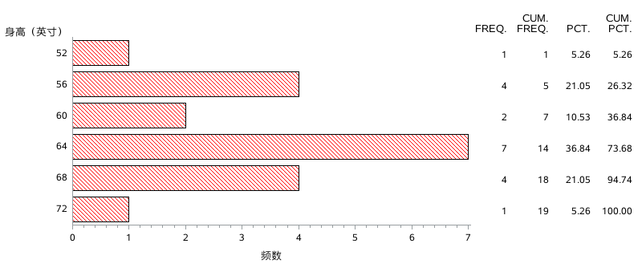
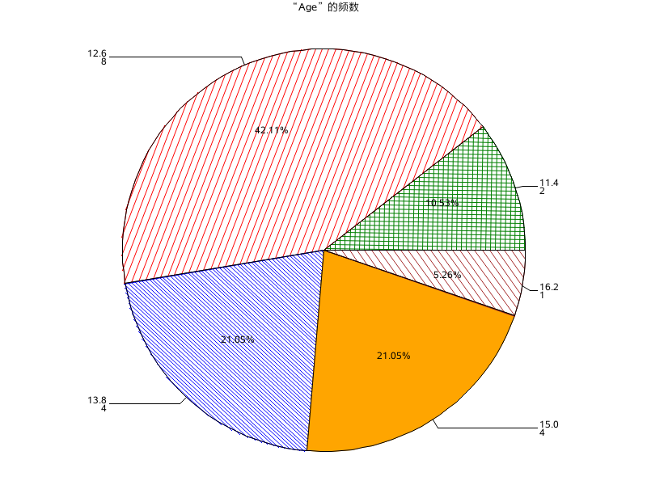

 

# **《统计计算与SAS软件》**


# **实验7   IML过程、作图**


<div align = "center">1907402030    熊雄</div>

<div align = "center">2021年11月17日</div>


## 实验目的

掌握SQL和IML过程的基础部分。


## 实验内容

### IML过程

1. IML中矩阵的输入及显示；
2. IML中矩阵的拼接（水平及垂直拼接）；
3. IML中矩阵的基本运算（矩阵的加减乘，求逆，矩阵的数乘）；
4. IML中矩阵关于行，列求和，求平均，取最大值，最小值等；
5. IML中统计函数举例（自已找）；
6. IML中创建SAS数据集。

### 作图（用sashelp.class数据集作图）

1. 画height和weight两变量的散点图，数据点用“红色三角形”表示；

2. 画height和weight两变量的连线图，用不同的线型，颜色，粗细表示连线特征；

3. 画height的直方图、年龄的饼图（可以设置值，填充颜色、类型等）。

   

## 结果与分析

### IML过程

####	IML中矩阵的输入及显示

输入以下SAS代码：

```SAS
proc iml;
	A = {[2]7 6,4 [2]2,[2]2 9};/*有重复元素时的列示法*/
	B = 2 # A;   /*赋值法*/
	print A, B; /*按列排列*/
quit;
```

提交后便生成了矩阵$$A= \begin{bmatrix}    7 & 7 & 6\\\    4 & 2 & 2\\\    2 & 2 & 9\\ \end{bmatrix}$$，$$B= \begin{bmatrix}    14 & 14 & 12\\\    8 & 4 & 4\\\    4 & 4 & 18\\ \end{bmatrix}$$。


####	IML中矩阵的拼接（水平及垂直拼接）

**水平拼接**：将具有相同行数的两个矩阵水平拼接为一个矩阵，使用||算符；

**垂直拼接**：将具有相同列数的两个矩阵垂直拼接为一个矩阵，使用//算符。

输入以下SAS代码：

```SAS
proc iml;
	A = {[2]7 6,4 [2]2,[2]2 9};/*有重复元素时的列示法*/
	B = 2 # A;   /*赋值法*/
	C = A || B;  /*水平拼接*/
	D = A // B;  /*垂直拼接*/
	PRINT C,D;
quit;
```

提交后可以得到矩阵$$C= \begin{bmatrix}    7 & 7 & 6 & 14 & 14 & 12\\\    4 & 2 & 2 & 8 & 4 & 4\\\    2 & 2 & 9 &4 & 4 & 18\\ \end{bmatrix}$$，矩阵$$D= \begin{bmatrix}    7 & 7 & 6\\\    4 & 2 & 2\\\    2 & 2 & 9\\ 14 & 14 & 12\\\    8 & 4 & 4\\\    4 & 4 & 18\\ \end{bmatrix}$$。


####	IML中矩阵的基本运算（矩阵的加减乘，求逆，矩阵的数乘）

输入以下代码，依次验证矩阵的加减乘，求逆与矩阵的数乘：

```SAS
proc iml;
	k = 5;
	A = {[2]7 6,4 [2]2,[2]2 9};/*有重复元素时的列示法*/
	B = 2 # A;   /*赋值法*/
	E = A + B;   /*矩阵相加*/
	F = B - A;   /*矩阵相减*/
	G = A * B;   /*矩阵相乘*/
	H = inv(A);  /*矩阵A的逆矩阵*/
	I = k * A;  /*矩阵的数乘*/
	PRINT E,F,G,H,I;
quit;
```

提交后得到结果查看器输出为：矩阵$E= \begin{bmatrix}    21 & 21 & 18\\\    12 & 6 & 6\\\    6 & 6 & 27\\ \end{bmatrix}$，矩阵$F= \begin{bmatrix}    7 & 7 & 6\\\   4 & 2 & 2\\\    2 & 2 & 9\\ \end{bmatrix}$，矩阵$G= \begin{bmatrix}    178 & 150 & 220\\\   80 & 72 & 92\\\    80 & 72 & 194\\ \end{bmatrix}$，矩阵$H= \begin{bmatrix}    -0.137255 & 0.5 & -0.019608\\\   0.3137255 & -0.5 & -0.098039\\\    -0.039216 & 0 & 0.1372549\\ \end{bmatrix}$，矩阵$I= \begin{bmatrix}    35 & 35 & 30\\\   20 & 10 & 10\\\    10 & 10 & 45\\ \end{bmatrix}$。


####	IML中矩阵关于行，列求和，求平均，取最大值，最小值等

输入以下代码：

```SAS
proc iml;
	A = {[2]7 6,4 [2]2,[2]2 9}; /*有重复元素时的列示法*/
	SUM_OF_ROW = A[,+]; /*矩阵A关于行求和*/
	SUM_OF_COLUMN = A[+,];  /*矩阵A关于列求和*/
	AVERAGE = A[:]; /*A的所有元素的平均*/
	MAX = A[<>]; /*A中元素的最大值*/
	MIN = A[><]; /*A中元素的最小值*/
	PRINT A, SUM_OF_ROW, SUM_OF_COLUMN, AVERAGE, MAX, MIN;
quit;
```

得到输出如下：



####	IML中统计函数举例

VEC_VAR: The variance of the elements of the first row of the matrix X；

MAT_VAR: The variance of the elements of the matrix X；

SM_VAR: The variance of the elements of a submatrix including the first two rows and the first two columns of the matrix X.


```SAS
PROC IML;
   x = {1 2 3,4 5 6,7 8 9};
   ssq = SSQ(x[1,]);
   sum = x[1,+];
   vec_var = (ssq - sum * sum / NCOL(x)) / (NCOL(x) - 1);
   jn = J(NROW(x));
   mat_mean = x[:]; 
   mat_var = SSQ(x - mat_mean * jn) / (NROW(x) * NCOL(x) - 1);
   submat = x[1:2,1:2];
   ssq_sub = SSQ(submat);
   sum_sub = SUM(submat);
   sm_var = (ssq_sub - sum_sub * sum_sub / (NCOL(submat) * NROW(submat))) / (NCOL(submat) * NROW(submat)-1);
   PRINT vec_var mat_var sm_var;
QUIT;
```

提交后得到输出如下：



####	IML中创建SAS数据集

输入以下代码：

```SAS
proc iml; 
	use sashelp.class; 
	read all var{name age height weight};
	htwt = height / weight; 
	new = age || htwt; 
	create ratio from new[colname={'age' 'h_w'}]; 
	append from new; 
	close ratio;
quit;
proc print;
run;
```

输出如下：



### 作图（用sashelp.class数据集作图）

#### height和weight两变量的散点图，数据点用“红色三角形”表示

输入以下SAS代码：

```SAS
proc gplot data = sashelp.class;
	symbol V = TRIANGLE, CV = RED, H = 2;
	plot weight * height;
run;
```

提交后得到如下散点图：



#### height和weight两变量的连线图

输入以下SAS代码：

```SAS
proc gplot data = sashelp.class;
	symbol i = JOIN, CI = GREEN, v = TRIANGLE, LINE = 3, CV = red, h = 2, pointlabel;
	plot weight * height;
run;
```

提交后得到如下散点图：



#### 画height的直方图、年龄的饼图

##### height的直方图

输入以下SAS代码：

```SAS
GOPTIONS RESET = ALL;
proc gchart data = sashelp.class;
	HBAR height / levels = 6 CFRAME = WHITE NOFRAME;
	PATTERN V = L2, C = red;
run;
```

提交后得到如下柱状图：



##### age的饼图

输入以下SAS代码：

```SAS
GOPTIONS RESET = ALL;
proc gchart data = sashelp.class;
	PIE age / slice = arrow percent = inside value = arrow;
	PATTERN1 v = p3x70, c = green; 
	PATTERN2 v = p2n45, c = red; 
	PATTERN3 v = p5, c = blue; 
	PATTERN4 v = ps, c = orange; 
	PATTERN5 v = p2n45, c = brown; 
run;
```

提交后得到如下饼图：



