 

# **《统计计算与*SAS*软件》**


# 实验9   描述性统计量的计算、图示


<div align = "center">1907402030    熊雄</div>

<div align = "center">2021年12月9日</div>


## 实验目的

数据的简单加工并掌握*means、univariate、freq*过程。


## 实验内容

以*sashelp.class*数据集为例。

1. 用*means*过程计算*weight*的均值，标准差，极差，四分位极差，方差，偏度，峰度，并将这些统计量保存到数据集*resultmeans*中；
2. 用*univariate*过程计算*height*的均值，标准差，极差，中位数，众数，方差，偏度，峰度，并将这些统计量的值保存到数据集*resultuni*中；
3. 对变量*height*画正态概率图（Q-Q图）、茎叶图、盒形图；
4. 用*freq*过程统计男，女生的频数，并考虑性别与年龄是否独立？
5. 将性别变量的值加标签：*M*表示成“男”，*F*表示成“女”；
6. 给变量加中文标签：*name*的标签为“姓名”，*sex*的标签为“性别”，*age*的标签为“年龄”，*height*的标签为“身高”，*weight*的标签为“体重”；
7. 将*weight*分成三组，<85为一组，用“轻”表示，85-100为一组，用“中”表示，>100为一组，表示为“重”。并考虑*sex*与这种分组间是否独立；
8. 画*height*和*weight*两变量的散点图，数据点用“红色三角形”表示；
9. 画*height*的直方图、年龄的饼图（可以设置值，填充颜色、类型等）；
10. 按性别分组，计算不同年龄的平均身高。


## 代码实现

### 利用*MEAN*过程分析*weight*

以下代码实现了用*means*过程计算*weight*的均值(mean)，标准差(std)，极差(range)，四分位极差(qrange)，方差(variance/var)，偏度(skewness/skew)，峰度(kurtosis/kurt)，并将这些统计量保存到数据集*resultmeans*中。

在 *SAS* 中提交如下代码：

```SAS
PROC MEANS  data = sashelp.class mean std range qrange var skew kurt;
var weight;
label mean = '均值' 
	std = '标准差' 
	range = '极差' 
	qrange = '四分位数极差' 
	var = '方差' 
	skew = '偏度' 
	kurt = '峰度';
output out = work.resultmeans 
	mean = mean 
	std = std 
	range = range 
	qrange = qrange 
	var = var 
	skew = skew 
	kurt = kurt; /*将输出结果保存在数据集resultmeans*/
RUN;
```

可以得到如下输出结果：

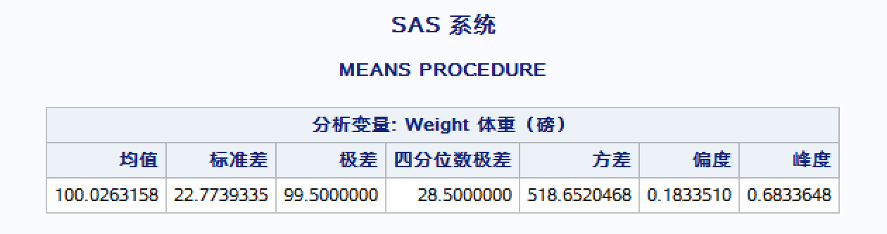


### 利用*UNIVARIATE*过程分析*weight*

以下代码实现了用*univariate*过程计算*height*的均值，标准差，极差，中位数，众数，方差，偏度，峰度，并将这些统计量的值保存到数据集*resultuni*中。

在 *SAS* 中提交如下代码：

```SAS
PROC UNIVARIATE data = sashelp.class; 
	var height;
	output out = work.resultuni;
run;
```

可以得到如下输出结果：

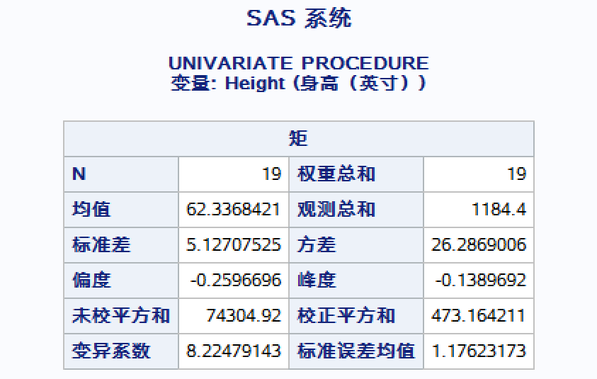


### 对变量*height*画图

#### 对变量*height*画正态概率图（Q-Q图）

在 *SAS* 中提交如下代码：

```SAS
PROC UNIVARIATE data = sashelp.class; 
	QQplot height;
run;
```

可以得到如下Q-Q图：

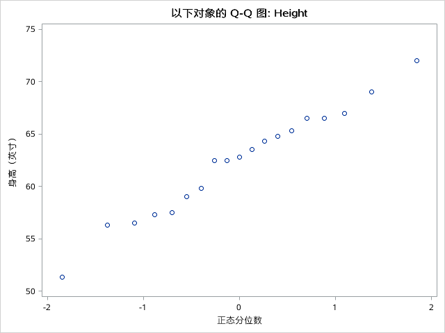


#### 对变量*height*画茎叶图与盒形图

使用PLOT选项UNIVARIATE 过程将产生三种图形：平行条状图 (Horizontal Bar Chart)、盒状图(Box Plot)、正态分布拟合图 (Normal Probability Plot)。在 *SAS* 中提交如下代码：

```SAS
ods select plots;
PROC UNIVARIATE data = sashelp.class plot; 
	var height;
RUN;
```

可以得到如下图形：

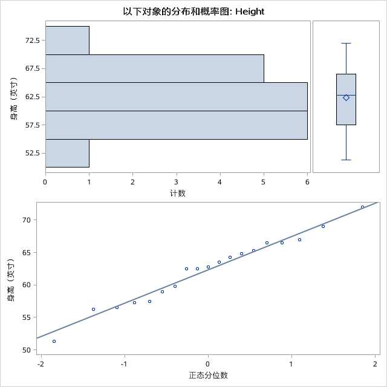


### 利用*freq*过程统计男，女生的频数，并考虑性别与年龄是否独立

在 *SAS* 中提交如下代码：

```SAS
PROC FREQ data = sashelp.class;
	table sex;
	table sex * age /chisq;
RUN;
```

可以得到如下结果：

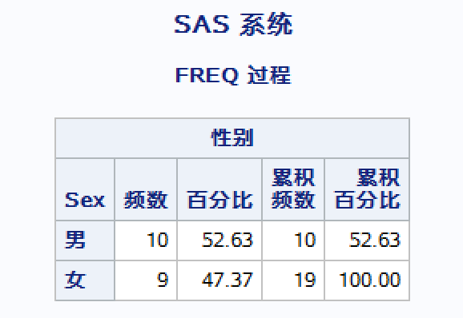

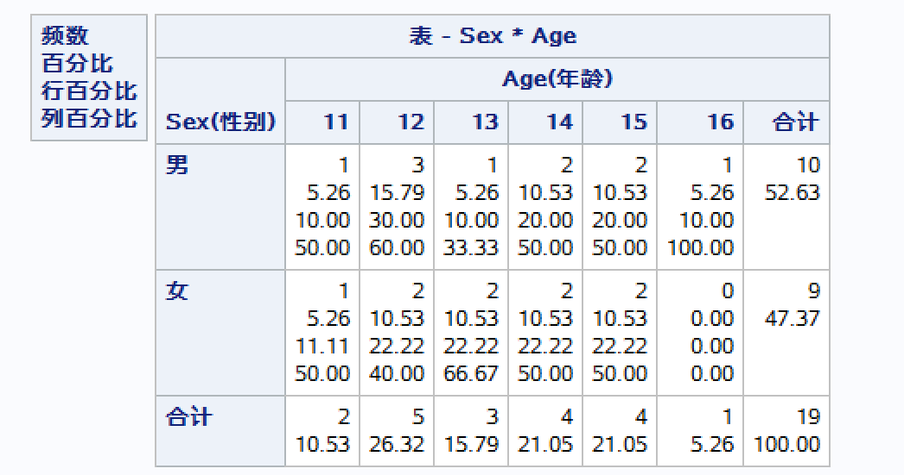


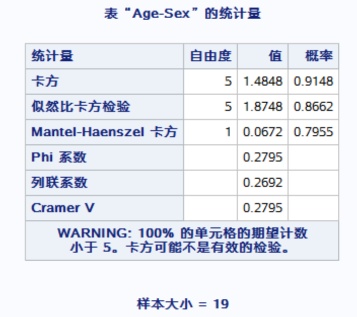

因此性别与年龄并不是相互独立的。


### 将性别变量的值加标签

利用*FORMAT*过程将性别变量的值加标签：*M*表示成“男”，*F*表示成“女”。在 *SAS* 中提交如下代码即可：

```SAS
PROC FORMAT;
	value $setsex 'M' = '男' 'F' = '女';
RUN;
DATA sss;
	set sashelp.class;
	format sex setsex.;
run;
```

打开数据集*work.sss*，可以看到性别已经变成中文了：

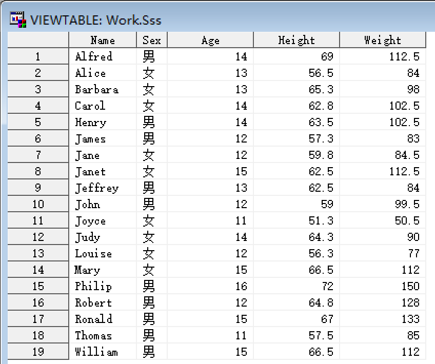


###  给变量加中文标签

在*DATA*步中给变量加中文标签：*name*的标签为“姓名”，*sex*的标签为“性别”，*age*的标签为“年龄”，*height*的标签为“身高”，*weight*的标签为“体重”。在 *SAS* 中提交如下代码：

```SAS
DATA sss;
set sss;
label name = '姓名'
	sex = '性别'
	age = '年龄'
	height = '身高'
	weight = '体重';
run;
```

打开数据集*work.sss*，点开变量就可以看到Label了：

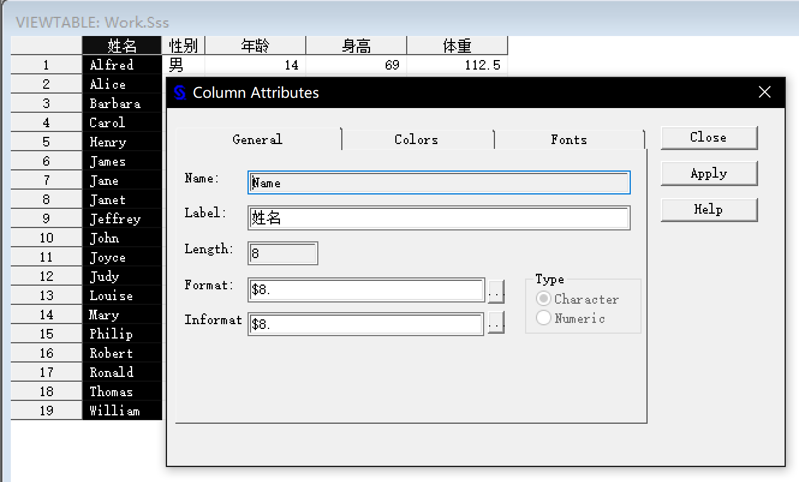


### 将*weight*分组

先利用*FORMAT*过程将*weight*分成三组的格式，<85为一组，用“轻”表示，85-100为一组，用“中”表示，>100为一组，表示为“重”，再利用*FREQ*过程实现分组。

```SAS
PROC FORMAT;
VALUE setweight LOW - 85 = '轻'
	85 - 100 = '中'
	100 - HIGH = '重';
RUN;

PROC FREQ data = work.sss;
	table weight;
	format weight setweight.;
	table sex * weight / chisq;
RUN;
```

得到输出如下：

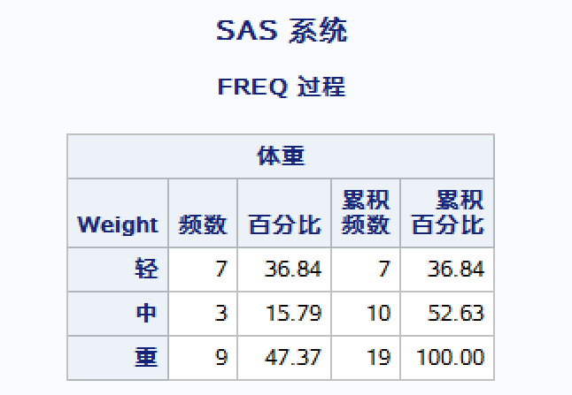

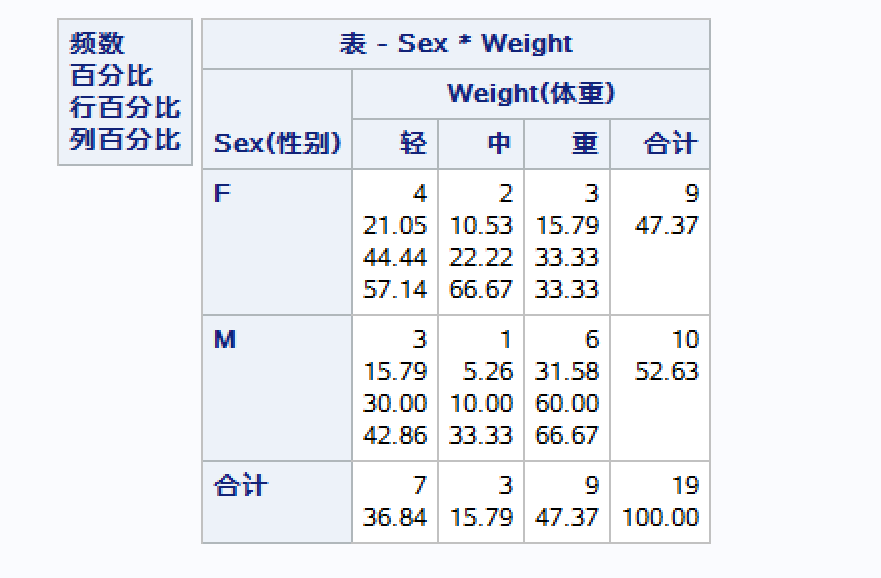

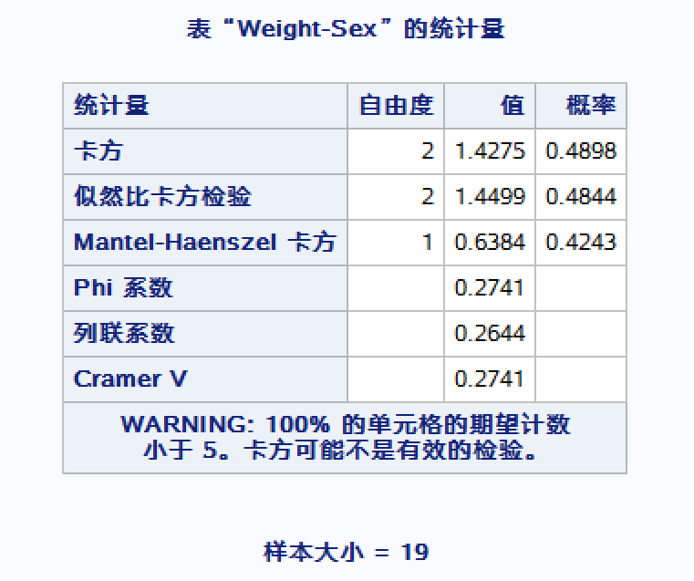

由“表‘Weight-Sex’的统计量”可以看到*sex*与这种分组间并不独立。


### 画*height*和*weight*两变量的散点图

画*height*和*weight*两变量的散点图，数据点用“红色三角形”表示；

```SAS
proc gplot data = sashelp.class;
	symbol V = TRIANGLE, CV = RED, H = 2;
	plot weight * height;
run;
```

得到如下图像：

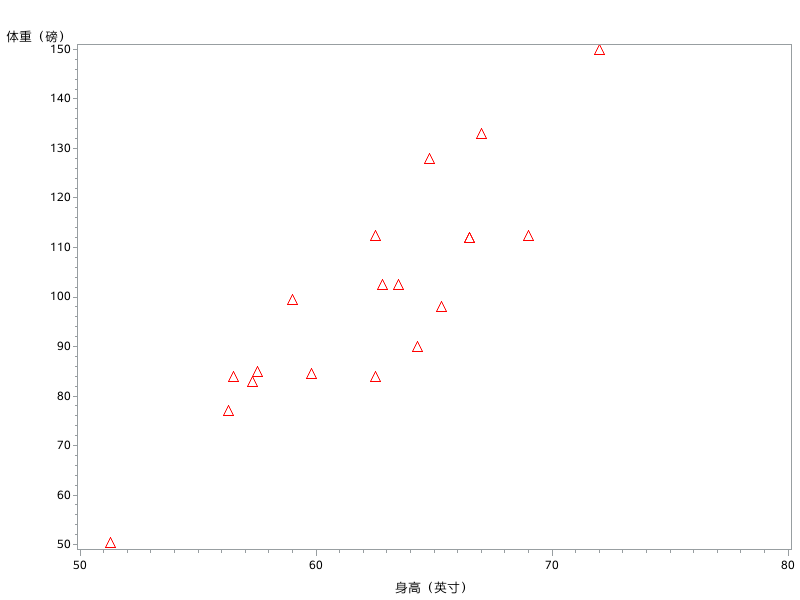


### 画*height*的直方图、年龄的饼图

#### *height*的直方图

输入以下*SAS*代码：

```SAS
GOPTIONS RESET = ALL;
proc gchart data = sashelp.class;
	HBAR height / levels = 6 CFRAME = WHITE NOFRAME;
	PATTERN V = L2, C = red;
run;
```

提交后得到如下直方图：

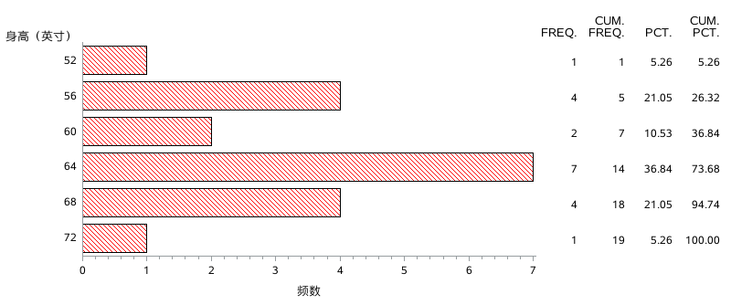


#### *age*的饼图

输入以下*SAS*代码：

```SAS
GOPTIONS RESET = ALL;
proc gchart data = sashelp.class;
	PIE age / slice = arrow percent = inside value = arrow;
	PATTERN1 v = p3x70, c = green; 
	PATTERN2 v = p2n45, c = red; 
	PATTERN3 v = p5, c = blue; 
	PATTERN4 v = ps, c = orange; 
	PATTERN5 v = p2n45, c = brown; 
run;
```

提交后得到如下饼图：

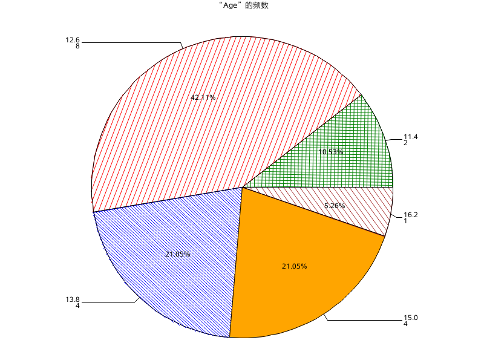


### 按性别分组，计算不同年龄的平均身高

输入以下*SAS*代码：

```SAS
PROC MEANS data = sashelp.class mean ; 
	class age sex; 
	var height;
RUN;
```

提交后得到如下表格，即按性别分组后，不同年龄的平均身高：

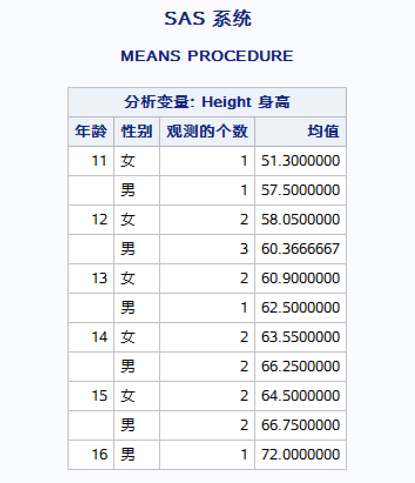


## 反思与总结

### 统计分析的几个常用过程

1. *MEANS*: 分类计算变量的常用统计量;
2. *UNIVARIATE*: 计算单变量的统计量和分布的拟合检验（正态检验histogram /normal lognormal）;
3. *FREQ*: 计算变量取值的频数。


### *FREQ*输出频数表格

```sas
PROC FREQ  DATA = 数据集名;      
	TABLES  变量*变量  变量*变量 . . ./
             nocol（不显示列统计）  norow（不显示行）  nocum  nofreq    
             nopercent   missing  list 
             out = 数据集 outpct ;
        WETGHT  变量名; #按照某个变量加权
        BY  变量名; #按照某个分类变量统计
RUN;
```


### 定义输出格式的*FORMAT*过程（对连续性变量分组）

```SAS
PROC  FORMAT   library=saslib;
 	VALUE  格式名       	
 	范围1 = 格式化值1 ….
    范围n = 格式化值n ;
 RUN; 
注1：对字符型数据定义格式，格式名要加前缀$。
注2：若范围超过一个值，离散值可以用，或-用于连续区间，此外<表示到某个临界值范围但不包括该值。
例:    ‘A’ = ‘Asia’
	1,3,5,7,9 = ‘Odd’
	50000 - HIGH = ‘Not Affordable’
	13 -< 20 = ‘Teenager’
	0 <- HIGH = ‘Positive Non Zero’
	OTHER = ‘Bad Data’
```


### *MEANS*—描述统计分析

#### *MEANS*过程步

```SAS
PROC MEANS  DATA = 数据集名 maxdec = 位数 fw = 域宽 noprint 输出统计量名列;
	VAR  变量名列;
	CLASS  变量名列;
	BY  变量名列;
	ID  变量名;
	OUTPUT  OUT= 数据集名 记入数据集统计量名列;
RUN;
```


#### *MEANS*过程常用选项：

```SAS
MAX 	the maximum value
MIN		the minimum value
MEAN	the mean
MEDIAN  the median
MODE	the mode(new in sas9.2)
N 	number of non-missing values
NMISS	number of missing values
RANGE	the range
STDDEV	the standard deviation
SUM	the sum
CLM	two-sided confidence limits
UCLM	upper confidence limits
LCLM	lower confidence limits
CSS   corrected sum of squares 离差平方和
USS   uncorrected sum of squares 平方和
ALPHA	 confidence level
CV	coefficient of variation
SKEWNESS	skewness
KURTOSIS	kurtosis
Q1(P25)		25% quantile
Q3(P75)		75% quantile
P1,P5,P10,P90,P95,P99
STDERR  	standard error of mean
VAR		variance
PROBT	      probability  for  Student’s t
T	    Student’s t
MAXDEC    number of   decimal places
FW	field width
```


### *UNIVARIATE*过程——单变量特征的概括描述

```SAS
PROC  UNIVARIATE  DATA = 数据集名  noprint ; 
	VAR 变量名列 ;
	HISTOGRAM  变量名列 /  midpoints=中点列 
	normal(mu=均值  sigma=标准差  图象选项)             
	exp(theta= 阈值  图象选项)              
	lognormal(theta=阈值  图象选项) … … ;
	INSET  统计量关键名= ‘显示名’   格式 ;
	QQPLOT  变量名列 /  square . . .  ; %检验是否正态/直线
	PROBPLOT  变量名列 /   . . .  ;
	BY 变量名列 ;      
	ID  变量名 ;
RUN ;
```


### 上述三种描述性过程的output区别

1. *FREQ* 

   在table后（选项） （一般输出频数 频数百分比）。

2. *MEANS* （与var并列） 

   output out=数据集 需要输出的统计量 （不设定的话 默认输出n min max mean 并且在一列）。

   （1）自己选择要输出的统计量后就会输出成不同的列；

   （2）第一行会输出一行汇总数据（一般无用）。

3. *UNIVARIATE*（与var并列）

   output out=数据集 需要输出的统计量 （不设定的话 只输出var的值）。
