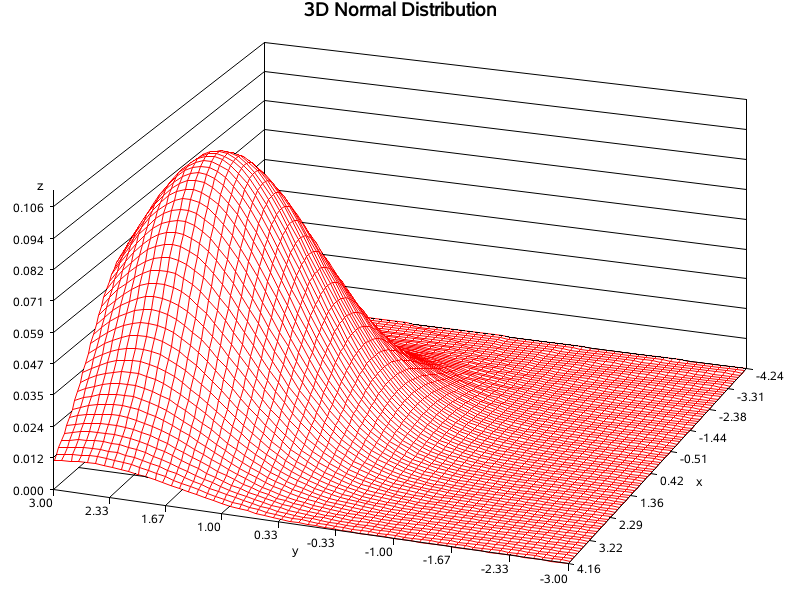
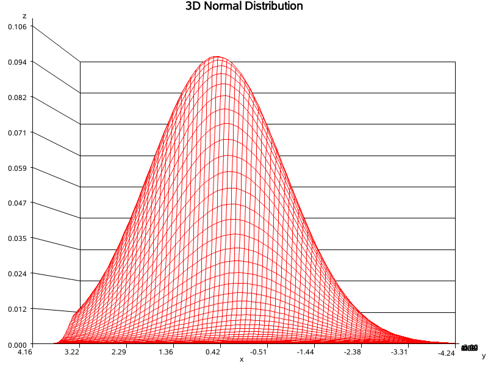

 

# **《统计计算与*SAS*软件》**


# **实验8   作 图**


<div align = "center">1907402030    熊雄</div>

<div align = "center">2021年12月1日</div>


## 实验目的

宏及作图混合使用。


## 实验内容

用带参数（参数为均值和方差，相关系数）的宏实现二元正态分布密度函数作图。

**Remark**：三维作图可调用过程 *proc g3d*（相关语法可以查找下）。


## 代码实现

### 过程说明

对一个二元函数 $z=f(x,y)$，我们有了 $x$ 取等间隔值、$y$ 取等间隔值时 $z$ 的值，这时我们可以用 *proc g3d* 绘制曲面图形，用 *gcontour* 绘制曲面的等高线图。

假设 $(X,Y) \sim (\mu_1,\mu_2,\sigma_1,\sigma_2,r)$ 。则 $(X,Y)$ 的联合密度函数的公式为：
$$
f(x,y)=\frac{1}{2\pi \sigma_1\sigma_2(1-r^2)}e^{-\frac{1}{2(1-r^2)}\left[\frac{(x-\mu_1)^2}{\sigma_1^2}+\frac{(y-\mu_2)^2}{\sigma_2^2}-2r\frac{(x-\mu_1)(y-\mu_2)}{2\sigma_1\sigma_2} \right]}
$$
我们令 $\delta=2\sigma_1\sigma_2(1-r^2)$，则联合密度函数的公式可化简为：
$$
f(x,y)=\frac{1}{\pi \delta}e^{-\frac{1}{\delta}\left[\frac{(x-\mu_1)^2\sigma_2}{\sigma_1}+\frac{(y-\mu_2)^2\sigma_1}{\sigma_2}-r(x-\mu_1)(y-\mu_2) \right]}
$$
于是我们可以在一个网格上计算该曲面的值。


### 代码部分

在 *SAS* 中提交如下代码：

```SAS
%let mean1 = 1; /*随机变量X的均值*/
%let mean2 = 2; /*随机变量Y的均值*/
%let var1 = 2; /*随机变量X的方差*/
%let var2 = 1; /*随机变量Y的方差*/
%let r = 0.5; /*相关系数*/
%let pi = 3.1415926;
Data norm;
	var1_1 = sqrt (&var1); /*随机变量X的标准差*/
	var2_1 = sqrt (&var2);  /*随机变量Y的标准差*/
	frac = var2_1 / var1_1; 
	delta = 2 * &var1 * &var2 * (1 - &r * &r);  /*对应前面分析的\delta代换*/
 	do x = -3 * var1_1 to 3 * var1_1 by 0.1;  /*循环*/
		do y = -3 * var2_1 to 3 * var2_1 by 0.1;
 			z = 1 / (&pi * delta) * exp (- 1 / delta * ( (x - &mean1)* (x - &mean1)* frac + (y - &mean2)*(y - &mean2) / frac - &r * (x - &mean1) * (y - &mean2)));
			output;
	end;
end;
keep x y z; 
run;
proc g3d data = norm;
  plot x * y = z / 
rotate = 160  /*Z轴的旋转角度为150°*/
tilt = 60 /*Y轴的旋转角度为60°*/
ctop = red 
caxis = black 
cbottom = blue 
grid 
xticknum = 10  /*X轴上刻度线的数目*/
yticknum = 10  /*Y轴上刻度线的数目*/
zticknum = 10;  /*Z轴上刻度线的数目*/
	title '3D Normal Distribution';  /*标题*/
run;
```


##  结果展示

上述代码提交后可得到下面的图像：



通过修改参数 *rotate* 和 *tilt* 的值可以改变 Z 轴与 Y 轴的旋转角度，得到多个角度的图像，例如我们将参数修改如下：

```SAS
rotate = 90  /*Z轴的旋转角度为90°*/
tilt = 160 /*Y轴的旋转角度为160°*/
```

则可以得到如下图像：




