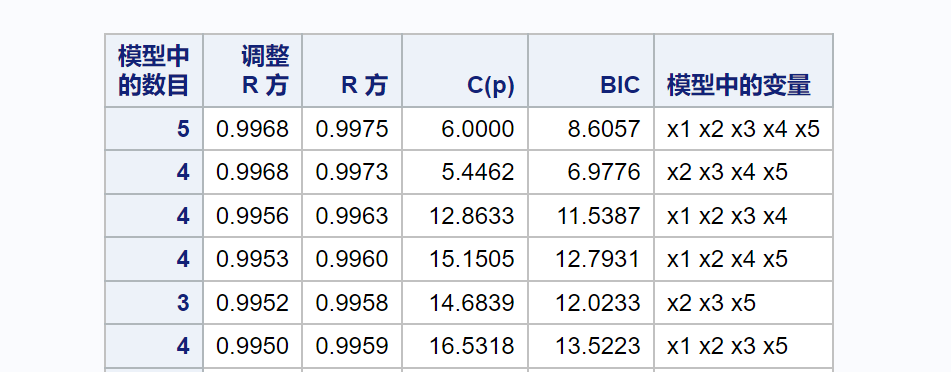

 


# **《统计计算与*SAS*软件》**


# 实验十   线性回归


<div align = "center">1907402030    熊雄</div>

<div align = "center">2021年12月24日</div>


## 实验目的

掌握回归`PROC reg`过程。


## 实验内容

已知一组数据如下：

| $x_1$   | $x_2$   | $x_3$   | $x_4$   | $x_5$    | $y$      |
| ------- | ------- | ------- | ------- | -------- | -------- |
| -0.3266 | 3.0424  | 2.4850  | -0.7792 | -1.0134  | 5.1372   |
| -0.0221 | 0.7274  | 1.3963  | 8.3166  | 19.2436  | 40.5900  |
| 1.0417  | -0.3599 | 1.6066  | 0.0375  | -0.1340  | 3.6541   |
| 1.6703  | 1.0266  | 5.9368  | 5.6695  | 13.7614  | 34.9407  |
| -0.1018 | 1.7781  | 1.2353  | -1.3943 | -2.7936  | 2.3227   |
| 0.1671  | 1.2308  | 2.6735  | -0.3745 | -1.6666  | 2.9883   |
| 0.3410  | -0.6692 | 0.6314  | 3.7651  | 8.6915   | 21.0286  |
| -0.2523 | -0.1129 | -0.3184 | 5.6556  | 13.0629  | 25.9300  |
| -0.2910 | 0.3272  | -0.4174 | 3.8557  | 9.3581   | 19.9263  |
| -0.3385 | -1.5787 | -3.0940 | -1.8342 | -2.7995  | -7.1717  |
| 1.1132  | 2.4489  | 4.4215  | -1.0626 | -2.2422  | 7.3373   |
| -1.0690 | 1.8439  | -2.1566 | -2.7720 | -6.8451  | -9.8014  |
| -1.1351 | 0.1507  | -1.7046 | 8.1457  | 19.2128  | 36.3739  |
| -1.3526 | 0.5871  | -1.8082 | 6.3918  | 12.9771  | 28.0547  |
| -0.2727 | 0.5776  | -0.0080 | -8.4728 | -18.6298 | -31.2190 |
| -1.1824 | 2.5766  | -1.3379 | 1.8826  | 4.8972   | 11.4541  |
| -1.1303 | 1.5472  | -1.8749 | 0.1608  | 0.8204   | 3.6461   |
| 0.0457  | 2.2283  | 1.0687  | 2.3181  | 4.6769   | 16.0320  |
| -0.3314 | 1.7619  | 0.7072  | 4.0692  | 9.1147   | 23.2611  |
| -1.6636 | 0.6891  | -2.0524 | 4.1248  | 7.8462   | 17.8610  |
| 0.4596  | 2.5260  | 4.7945  | -0.8341 | -1.8395  | 6.4449   |
| 0.3149  | 2.0868  | 2.7935  | 4.0267  | 8.0134   | 24.0171  |
| -0.3282 | 1.4317  | 0.1383  | 4.9181  | 10.8442  | 24.3683  |
| 1.8427  | 0.9875  | 3.5959  | 1.5075  | 4.7527   | 16.6028  |
| -0.2687 | 0.4530  | 1.1492  | -5.1177 | -12.2972 | -17.0680 |

请建立回归模型并进行回归分析，要求以下四个部分必须给出：

1. 请判断是否存在多重共线性，若有则需要给出诊断；
2. 给出用逐步回归法和全子集法建立的线性回归模型；
3. 给出用主成分回归方程和岭回归方程；
4. 给出影响分析与残差分析的结果。


## 代码实现

### 建立数据集work.test

在*SAS*中输入以下代码并提交来建立数据集：

```SAS
data test;
	input x1 x2 x3 x4 x5 y;
	cards;
-0.3266 	3.0424 		2.4850 		-0.7792 	-1.0134 	5.1372 
-0.0221 	0.7274 		1.3963 		8.3166 		19.2436 	40.5900 
1.0417 		-0.3599 	1.6066 		0.0375	 	-0.1340 	3.6541 
1.6703 		1.0266	 	5.9368 		5.6695 		13.7614 	34.9407 
-0.1018 	1.7781	 	1.2353 		-1.3943 	-2.7936 	2.3227 
0.1671 		1.2308 		2.6735 		-0.3745 	-1.6666 	2.9883 
0.3410 		-0.6692 	0.6314 		3.7651 		8.6915 		21.0286 
-0.2523 	-0.1129 	-0.3184 	5.6556 		13.0629 	25.9300 
-0.2910 	0.3272 		-0.4174 	3.8557	 	9.3581 		19.9263 
-0.3385 	-1.5787 	-3.0940 	-1.8342 	-2.7995 	-7.1717 
1.1132 		2.4489	 	4.4215	 	-1.0626 	-2.2422 	7.3373 
-1.0690 	1.8439 		-2.1566 	-2.7720 	-6.8451 	-9.8014 
-1.1351 	0.1507 		-1.7046 	8.1457 		19.2128 	36.3739 
-1.3526 	0.5871 		-1.8082 	6.3918 		12.9771 	28.0547 
-0.2727 	0.5776 		-0.0080 	-8.4728 	-18.6298 	-31.2190 
-1.1824 	2.5766 		-1.3379 	1.8826 		4.8972	 	11.4541 
-1.1303 	1.5472 		-1.8749 	0.1608 		0.8204 		3.6461 
0.0457 		2.2283 		1.0687 		2.3181 		4.6769 		16.0320 
-0.3314 	1.7619 		0.7072 		4.0692	 	9.1147	 	23.2611 
-1.6636 	0.6891 		-2.0524 	4.1248 		7.8462 		17.8610 
0.4596	 	2.5260 		4.7945	 	-0.8341 	-1.8395 	6.4449 
0.3149 		2.0868 		2.7935 		4.0267 		8.0134 		24.0171 
-0.3282 	1.4317	 	0.1383	 	4.9181 		10.8442 	24.3683 
1.8427 		0.9875 		3.5959 		1.5075 		4.7527 		16.6028 
-0.2687 	0.4530 		1.1492 		-5.1177 	-12.2972 	-17.0680
 ;
run;
```


### 判断是否存在多重共线性并给出诊断

在*SAS*中继续输入以下代码：

```SAS
proc reg data = work.test;
	model y = x1 x2 x3 x4 x5 / vif;
run;
```

提交后可以得到如下输出：


> 若使用`VIF`选项，当$VIF_i>10$时，表示$X_i$可能和某些变量存在高度共线性；
>
> 若使用`COLLIN`选项，则其条件指数 （$condition\  index$）$>10$表示有共线性，$>30$表示有严重共线性；同一行两个变量的变异构成（$proportion \ of \ variation$）同时$>50\%$表示两者有共线性。

在本数据集中，通过参数估计可以看到$VIF_4,VIF_5>10$，故变量$x_4,x_5$之间存在严重共线性。通过共线性诊断可以看到，最大的条件指数为$33.26700>10$，$x_4,x_5$的偏差比例都超过了$0.5$。因此，如果一个模型中同时包含$x_4,x_5$这两个变量，则得到的结果就会很不稳定，甚至造成误导。


### 逐步回归法和全子集法建立的线性回归模型

#### 逐步回归法

在*SAS*中继续输入以下代码：

```SAS
proc reg data = work.test;
	model y = x1 - x5 / SELECTION = stepwise;
run;
```

提交后可以得到如下输出：


因此应该选择$x_2,x_3,x_4,x_5$来建立线性回归模型。


#### 全子集法

在*SAS*中继续输入以下代码：

```SAS
proc reg data = work.test;
	model y = x1 - x5 / SELECTION = adjrsq cp bic;
run;
```

提交后可以得到如下输出：



因此应该选择$x_2,x_3,x_4,x_5$来建立线性回归模型。


### 岭回归方程和主成分回归方程

#### 岭回归

在*SAS*中继续输入以下代码：

```SAS
proc reg data = work.test outest = work.rghald outvif graphics corr;
	model y = x1 - x5 / ridge = 0 to 1 by 0.05;
	plot / ridgeplot;
run;
proc print data = work.rghald;
run;
```

> 其中`outest = work.rghald`表示将`PROC REG`过程将结果保存在$work.rghald$数据集中，选项`outvif`要求输出方差膨胀因子，选项`graphics`要求在高分辨率方式下作图，`corr`则要求计算相关系数。`plot`语句后加上参数`ridgeplot`，要求作出岭迹图。

提交后可以得到如下输出：


因此可以选择$k=0.05$的岭回归估计，得到如下岭回归模型：

$y=3.79288	+0.73945x_1+0.90090x_2+0.77507x_3+2.057x_4+0.900x_5.$


#### 主成分回归

在*SAS*中继续输入以下代码：

```SAS
proc reg data = work.test outest = pchald outvif;
	model y = x1 - x5 /  pcomit = 1, 2;
run;
proc print data = work.pchald;
run;
```

> `pcomit = 1,2`表示分别求出在删除最后$1$个和$2$个主成分后所得到的回归方程。

提交后可以得到如下输出：


因此，删除最后$1$个主成分后所得到的回归方程为:

$y=3.51097+0.66957x_1+0.94445x_2+0.83492x_3+2.10131x_4+0.92705x_5.$

删除最后$2$个主成分后所得到的回归方程为:

$y=3.51227+0.85298x_1+1.01408x_2+0.75878x_3+2.09914x_4+0.92945x_5.$


### 残差分析与影响分析

在*SAS*中继续输入以下代码：

```SAS
proc reg data = work.test;
	model y = x1 - x5 / r;
	plot student.*p.;
run;
```

> 选项`r`要求给出残差及$COOK\  D$值，`plot student.*p.`语句要求打印残差图，$student$和$p$后的点号($.$)不可省略，分别表示调用程序输出中的学生化残差和预测值。

提交后可以得到如下输出：


从学生化残差图可以看出，模型关于误差正态性条件得到满足。

一般认为$COOK \ D$值的临界值为$\frac 4n=0.16$知，有一个$D$值比此值小（图中蓝紫色部分），所以该观测对模型的影响是不合理的，因此这一模型不可用于实际工作。


## 代码展示

```SAS
data test;
	input x1 x2 x3 x4 x5 y;
	cards;
-0.3266 	3.0424 		2.4850 		-0.7792 	-1.0134 	5.1372 
-0.0221 	0.7274 		1.3963 		8.3166 		19.2436 	40.5900 
1.0417 		-0.3599 	1.6066 		0.0375	 	-0.1340 	3.6541 
1.6703 		1.0266	 	5.9368 		5.6695 		13.7614 	34.9407 
-0.1018 	1.7781	 	1.2353 		-1.3943 	-2.7936 	2.3227 
0.1671 		1.2308 		2.6735 		-0.3745 	-1.6666 	2.9883 
0.3410 		-0.6692 	0.6314 		3.7651 		8.6915 		21.0286 
-0.2523 	-0.1129 	-0.3184 	5.6556 		13.0629 	25.9300 
-0.2910 	0.3272 		-0.4174 	3.8557	 	9.3581 		19.9263 
-0.3385 	-1.5787 	-3.0940 	-1.8342 	-2.7995 	-7.1717 
1.1132 		2.4489	 	4.4215	 	-1.0626 	-2.2422 	7.3373 
-1.0690 	1.8439 		-2.1566 	-2.7720 	-6.8451 	-9.8014 
-1.1351 	0.1507 		-1.7046 	8.1457 		19.2128 	36.3739 
-1.3526 	0.5871 		-1.8082 	6.3918 		12.9771 	28.0547 
-0.2727 	0.5776 		-0.0080 	-8.4728 	-18.6298 	-31.2190 
-1.1824 	2.5766 		-1.3379 	1.8826 		4.8972	 	11.4541 
-1.1303 	1.5472 		-1.8749 	0.1608 		0.8204 		3.6461 
0.0457 		2.2283 		1.0687 		2.3181 		4.6769 		16.0320 
-0.3314 	1.7619 		0.7072 		4.0692	 	9.1147	 	23.2611 
-1.6636 	0.6891 		-2.0524 	4.1248 		7.8462 		17.8610 
0.4596	 	2.5260 		4.7945	 	-0.8341 	-1.8395 	6.4449 
0.3149 		2.0868 		2.7935 		4.0267 		8.0134 		24.0171 
-0.3282 	1.4317	 	0.1383	 	4.9181 		10.8442 	24.3683 
1.8427 		0.9875 		3.5959 		1.5075 		4.7527 		16.6028 
-0.2687 	0.4530 		1.1492 		-5.1177 	-12.2972 	-17.0680
;
run;

proc reg data = work.test;
	model y = x1 x2 x3 x4 x5 / VIF COLLIN;
run;

proc reg data = work.test;
	model y = x1 - x5 / SELECTION = stepwise;
run;

proc reg data = work.test outest = work.rghald outvif graphics corr;
	model y = x1 - x5 / ridge = 0 to 1 by 0.05;
	plot / ridgeplot;
run;
proc print data = work.rghald;
run;

proc reg data = work.test outest = pchald outvif;
	model y = x1 - x5 /  pcomit = 1,2;
run;
proc print data = work.pchald;
run;

proc reg data = work.test;
	model y = x1 - x5 / SELECTION = adjrsq cp bic;
run;

proc reg data = work.test;
	model y = x1 - x5 / r;
	plot student.*p.;
run;
```

