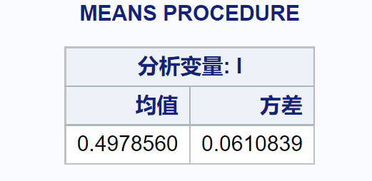
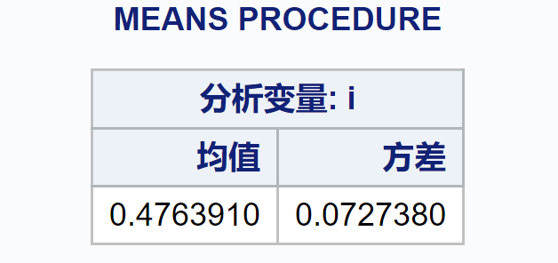

 


# **《统计计算与*SAS*软件》**


# 实验十一   随机模拟


<div align = "center">1907402030    熊雄</div>

<div align = "center">2021年12月31日</div>


## 实验目的

随机数的产生。


## 实验内容

用投点法和样本均值法求积分$\begin{aligned}I = \int _1^5\frac{\sin(2x)}{\ln(x+1)}dx \end{aligned}$的值，给出计算步骤和流程图，并比较二种估计方法的方差大小。


## 代码实现

### 投点法

> <u>回顾随机投点法的基本步骤</u>
>
> ① 赋初值:试验次数$n=0$，成功次数$m=0$；规定投点试验的总次数$N$；
>
> ② 产生两个相互独立的均匀随机数$X,Y\sim U(0,1)$，置$n=n+1$；
>
> ③ 判断$n≤N$是否成立，若成立转④；否则停止试验，转⑤;
>
> ④ 判断条件$Y\le f(X)$是否成立，若成立置$m=m+1$，转②；否则直接转②;
>
> ⑤ 计算$\begin{aligned}\frac m N\end{aligned}$，则$\theta_1 \approx \begin{aligned}\frac m N\end{aligned}$。


设$\begin{aligned}f(x)=\frac{\sin(2x)}{\ln(x+1)}\end{aligned}$，显然在$x\in [1,5]$上$\begin{aligned}\left|\frac{\sin(2x)}{\ln(x+1)}\right|\le\frac{1}{\ln2}<2\end{aligned}$ 有界。

令$x=4u+1$，则$\begin{aligned}I = \int _1^5f(x)dx =\int_0^14f(4u+1)du =16\int_0^1\left(\frac{\frac{4\sin(8u+2)}{\ln(4u+2)}+2}{4} \right) du  -8 \end{aligned}$，此时$I$化为$[0,1]$上被积函数值在$[0,1]$之间的积分。令$\begin{aligned}g(u)= \frac{1}{4}\left({\frac{4\sin(8u+2)}{\ln(4u+2)}+2}\right)\end{aligned}$。

在*SAS*中输入以下代码：

```SAS
data test11;
Do k = 1 to 1000; /*投点试验的总次数N*/
	m = 0; /*成功次数m*/
	Do n = 1 to 1000; /*试验次数n*/
		/*产生两个相互独立的均匀随机数*/
		a = ranuni(32789); 
		b = ranuni(32789); 
		/*判断条件b <= f(a)是否成立*/
		if b <= (4 * sin(8 * a + 2) / log(4 * a + 2) + 2) / 4
			then m = m + 1; /*条件成立则成功次数+1*/
	end;
 	I = m / 1000 * 16 - 8; 
 	output;
end;
run;

proc means data = test11 Mean Var;
	var I;
run;
```

提交后可以得到：



即$\begin{aligned}I = \int _1^5\frac{\sin(2x)}{\ln(x+1)}dx \end{aligned}\approx0.4978560$.


### 样本均值法

> <u>回顾平均值估计法的计算步骤：</u>
>
> ① 产生$[0,1]$区间的均匀随机数$r_1,r_2,...,r_N $；
>
> ② 计算$\begin{aligned}f(r_i)\ (i=1,2,...,N)\end{aligned}$；
>
> ③ 令$\begin{aligned}\theta_2 = \frac 1 N \sum_{i=1}^Nf(r_i) \end{aligned}$  ,则$\theta_2$为积分值$I$的近似解。

在*SAS*中输入以下代码：

```sas
data test12;
Do k = 1 to 1000; /*总次数N*/
	sum = 0;
	n = 1000;/*均匀随机数个数n*/
	Do i = 1 to n; 
		a = ranuni(32789);  
		sum = sum + (4 * sin(8 * a + 2) / log(4 * a + 2) + 2) / 4;
	end;
 	I = sum / n * 16 - 8; 
 	output;
end;
run;

proc means data = test12 Mean Var;
	var I;
run;
```

提交后可以得到：



即$\begin{aligned}I = \int _1^5\frac{\sin(2x)}{\ln(x+1)}dx \end{aligned}\approx 0.4763910$.


